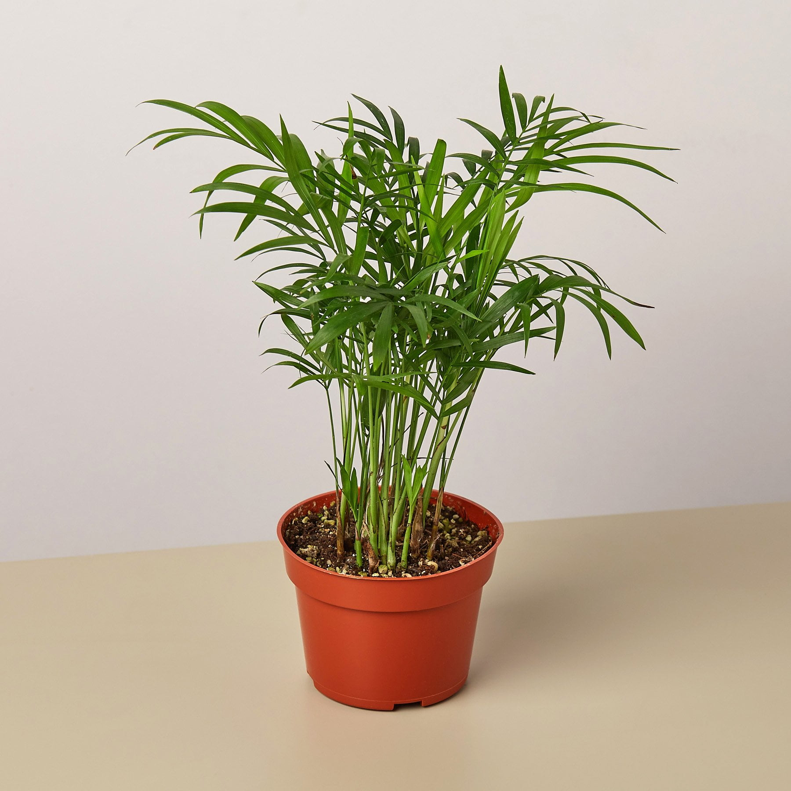

## Seems easier

leaves are more grouped, less spread out and not covering the dirt 

* Snake Plant
* Peace Lily
* Fiddle Leaf Fig (Tree look, have clearance between plot and lowest leaves)

* Rubber Plant (Similar as above, but in middle, could have covered up version as well)

* Chinese Evergreen (This is in middle, could get cases of covered up or loose)

* Monstera (huge leaves, but dirt is somewhat exposed)

* Dracaena (Tree ish version of spider plant)

* Aloe Vera 

* Bamboo Palm (tree ish, tall and exposed dirt) 

* Parlor Palm (same as above) 

## Dirt Covered

These seems like leaves could be more grown and covering the dirt

* Spider Plant
* Pothos (this expand and can grown to the ground)
* Boston Fern
)
* Maidenhair Fern (really depends on the state of the plant)

## Conclusion: 

Simply select some commonly seen indoor herbs. small-ish pot.

Since the training will be based from external images, and yolo will not see the target object during training, the exact plant isn't important. But rather, it needs some variety.