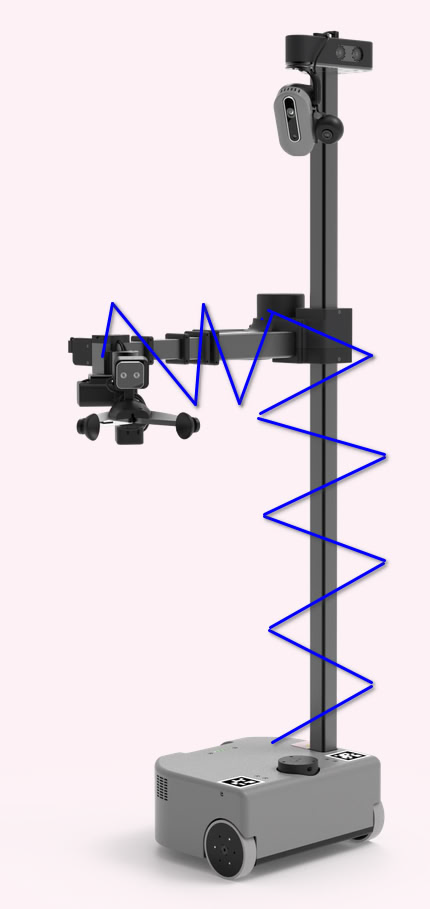

possible hose arrangement layout:

The coil option, Idea come from TV station's radio van's antenna. No idea how the coil retain the even spacing. 

This is basically a passive scissor lift, with retaining clip at corner and middle to roughly constrain the pipe but allow it to have some bending radius. 

---

Drag chain options: 

Need a S shape drag chain to allow it to be shrink-able. Or join together multiple drag-chain with inverted flex direction. to allow piling up at the base