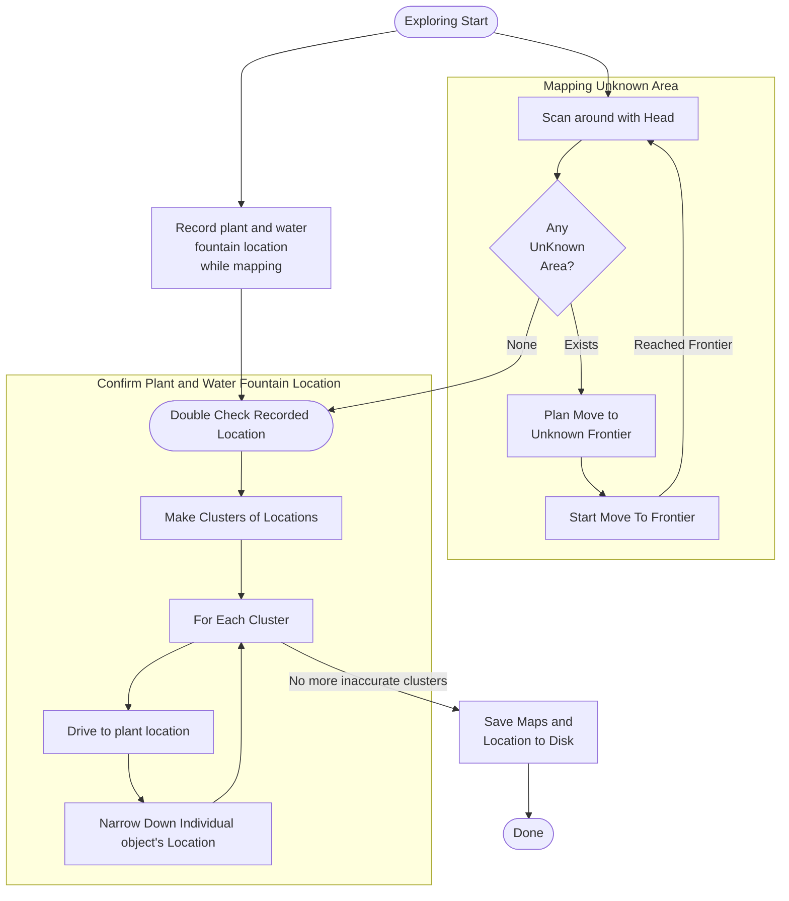
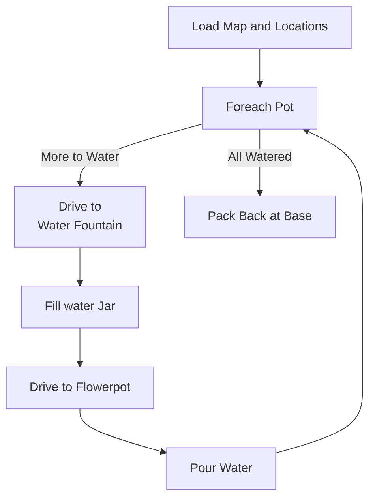

## Over all system flow chart 

The system will have two stages. One is mapping, the other is watering.

In the mapping/explore stage, robot drive around the room just to build a 3d map with plant and water fountain's location labeled. 

In the watering stage, robot navigate to water fountain and plant to perform watering task.

**Mapping/Explore Stage**

**Watering Stages**

