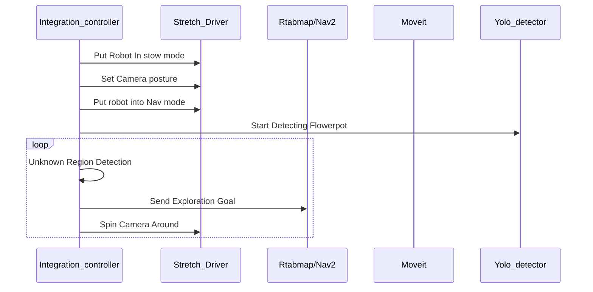

Detailed sequence diagram for explor phase.

```mermaid

sequenceDiagram
  participant line_4 as Integration_controller
  participant line_1 as Stretch_Driver
  participant line_2 as Rtabmap/Nav2
  participant line_3 as Moveit
  participant line_5 as Yolo_detector
  line_4 ->> line_1: Put Robot In stow mode
  line_4 ->> line_1: Set Camera posture
  line_4 ->> line_1: Put robot into Nav mode
  line_4 ->> line_5: Start Detecting Flowerpot
  Loop
    line_4 ->> line_4: Unknown Region Detection
    line_4 ->> line_2: Send Exploration Goal 
  line_4 ->> line_1: Spin Camera Around
  end
```