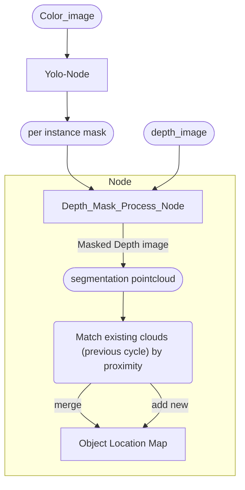

Here is a simple tutorial from ultralytics 

https://docs.ultralytics.com/guides/ros-quickstart/#point-clouds-step-by-step-usage

## Existing full package.

Here is a repo with the detection pipeline figured out. Problem is it seems to be using pointcloud from lidar, which mean not expecting depth image and might be missing some efficiency.

https://github.com/Alpaca-zip/ultralytics_ros

Problem: This package requires numpy 1.23.4 while the stretch system require numpy 1.23.2

## Rotated image

The image from camera is rotated. So I need to un-rotate it before sending to yolo 

https://stackoverflow.com/questions/71960632/how-to-rotate-a-rectangle-bounding-box-together-with-an-image

### Inverted point cloud

There was a mistake on initially rotate the image back in the wrong way (instead, rotated at the same direction for extra 90 deg)

Which resulted in a very funny output: 

A proper working one after fixing: 

## Building custom depth-> point cloud generator.

Object Location Map: 
* index/id
* centroid x,y
* pointcloud

### Merging new detected point cloud.

Assosciate newly detected point cloud to previous.

For each cluster, use its centroid. compare to existing cluster's centroid. If they are within some threshold, add them.

The threshold could just be a manually set value, bascially the minmal offset of any two flowerpot. 

Or it could be a dynamic value from the dimension of the point cloud, example: the threshold is 0.9 times the point cloud's 3d bounding box diameter. aka the new clouds need to mostly land inside the old clouds.

Another idea is to compose a global cluster of all objects, 
1. Try adding the new measure into this global cluster.
2. do a geomatric partitioning of the global cluster,
3. See which cluster this new cloud falls into, to decide which "object" to add it to