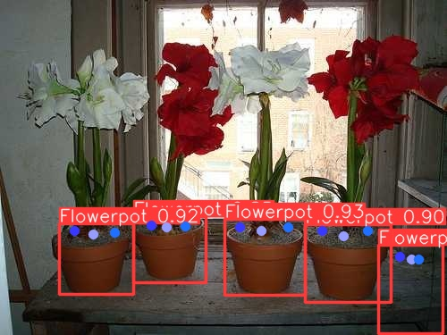

In the E-E design, we basically want to do a keypoint detection of "watering spot" for the plant.  

https://github.com/feyzanuraydinn/YOLOv8-Keypoint-Detection-Custom-Dataset-Tutorial

Quickly tried it with simple dataset, got a ok -ish result actually. 64 image training data, so the model only work on some objects.

