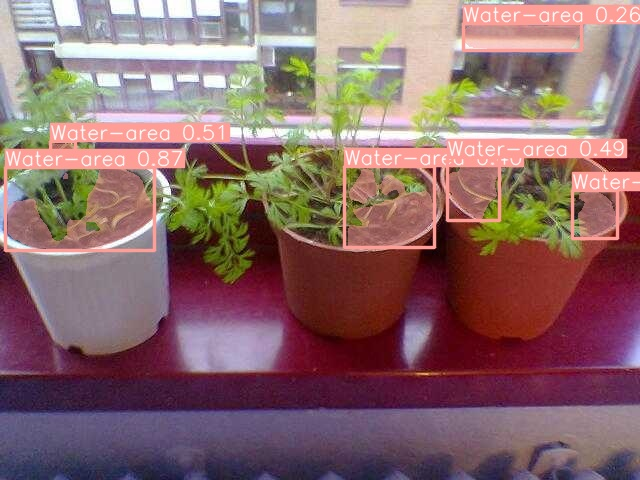

Since when watering a plant, we always look from top down to the plant. Visually make sure we see the soil bit. Then water onto the soil.

A btm up view of the flower pot is useless for finding out how to water.

We could do a simple segmentation model that find out the image inner bit of the pot, specially where the soil is to water on.

## Experinment result:

I start with first 500 images from OpenImages that contain flowerpot label. Then I selectively labeled around 180 images that have the expected view that can see a watering region. These 180 images are given to yolo for training.

The result is somewhat promising.

However, the model easily gives false positives as well, for example: 

This is likely due to not having negative training data. 

On the other hand, if this problem persists, we could simply use a two stage approach where first stage crop out the flower pot only.  