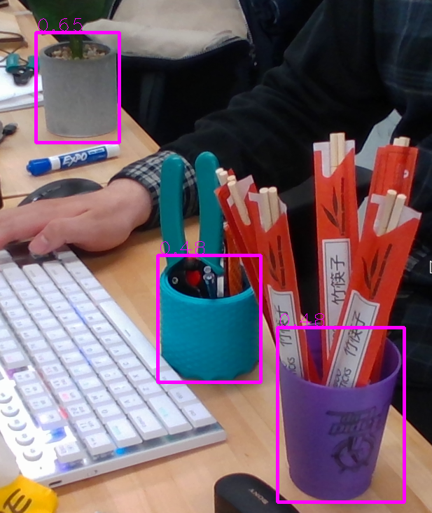
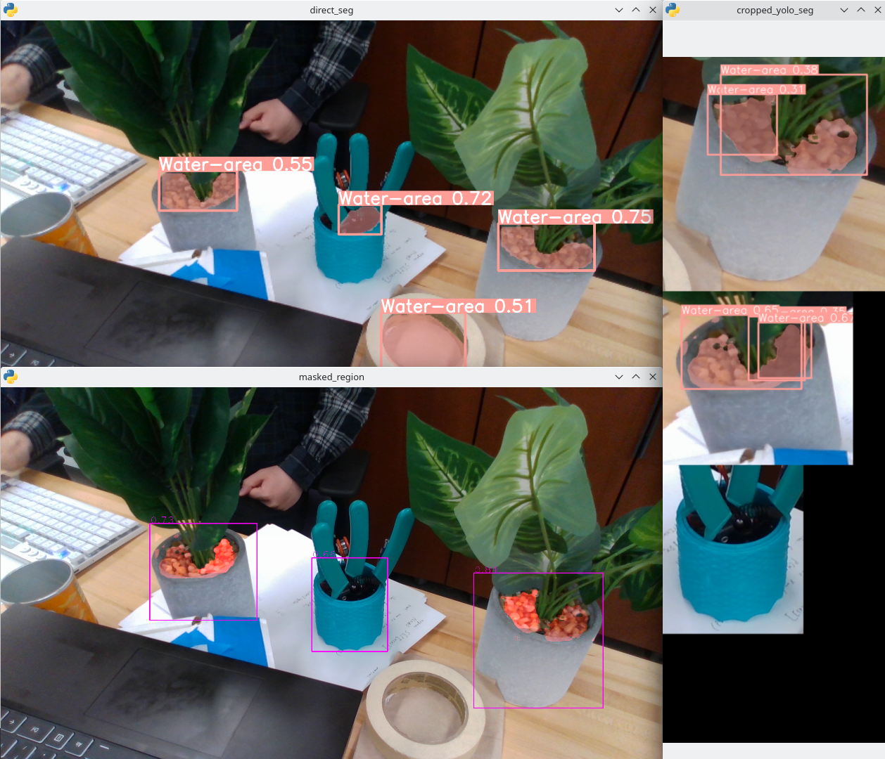

## Easy false positive

This bbox model is trained with 5000 images, but with just images of flowerpot.

As a result, it easily produce false positives.

This should be able to be solved by adding images doesn't contain flowerpot.

## False positive in watering area

The water-area segmentation model also suffer the same problem. 

I was totally expecting this as the watering area are much easier to be confused, and 180 samples are not much for producing a accurate model.

The trick I did was concatenate a flowerpot bbox model and cropping the image before giving it to watering area detection. This removed most false positive in both case. With the cost of the watering region detected is not as accurate.

Note: The same trick would not have worked if I applied the two model in parallel, then select the segments that have flowerpot bbox. 

Here is an image 

The top image is directly applying water-area prediction.

The btm image is the two staged prediction with bbox, then crop the image, then water-area prediction.

The colum on the right is the list of cropped image that get individually evaluated by water-area model. 

We can see the water-area detection is over-detecting a lot on the pot. But did not find watering area on a case of the pen holder, which it did if it were being directly predicted.
