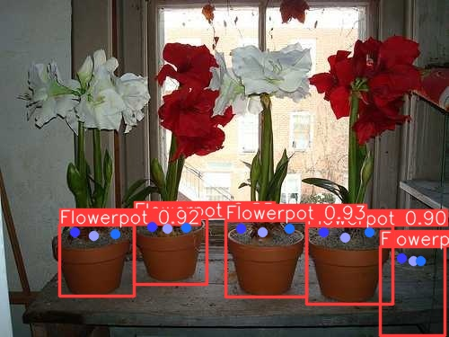
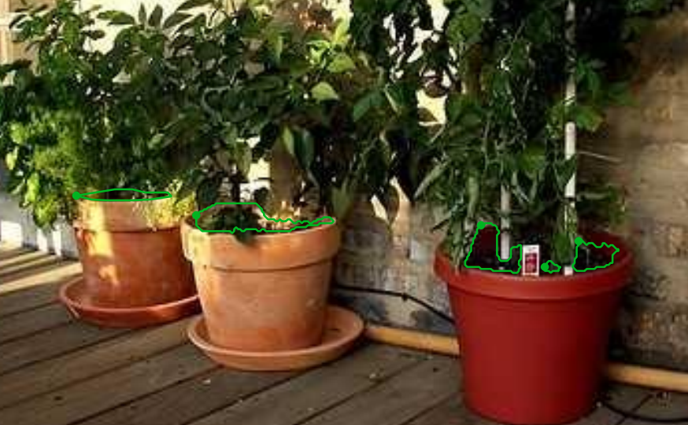

## Progress On E2E watering point model

While looking into the YOLO models, found the keypoint option, called "pose" in YOLO's document. Seems like a good option to directly use for the E-E watering point training.

The YOLO keypoint basically is a object detection (bbox) and a set of ordered list of points of interests (encoding relationships)

### Experiment

Labeled 80 training images with keypoints. I choosed to have 3 keypoints: LeftWatering, MidWater, RightWatering. As points to water the plant with.

Here is an example of the labeled image: 

The model's prediction after training on this small dataset (64 for training) seems ok. The trail dataset is too small for it to be reliable, but does seems to work in some case: 

## Alternative solution proposal:    

While labeling these images, I realized the target setting actually have more constrain on the view of the flower pot. For watering the plant, our camera is most likely looking down onto the pot. If the pot is higher then the camera, then the point of watering is behind occlusion, which have many uncertainty about how the plant is sets inside the pot (even we can detect pots and model it in 3d very well).

On that, if we can always see the top surface of the potted plant, that mean the top area for watering is visible. In this case, I could train a segmentation model to find "water-able area" of a potted plant.

This is also a E-E model as an alternative to keypoint.

Example on the image labels 

And considering the workflow, we could do watering area detection after the robot have approached the pot. which will be a more determined view (like 45 deg looking down onto the plant) like this image

